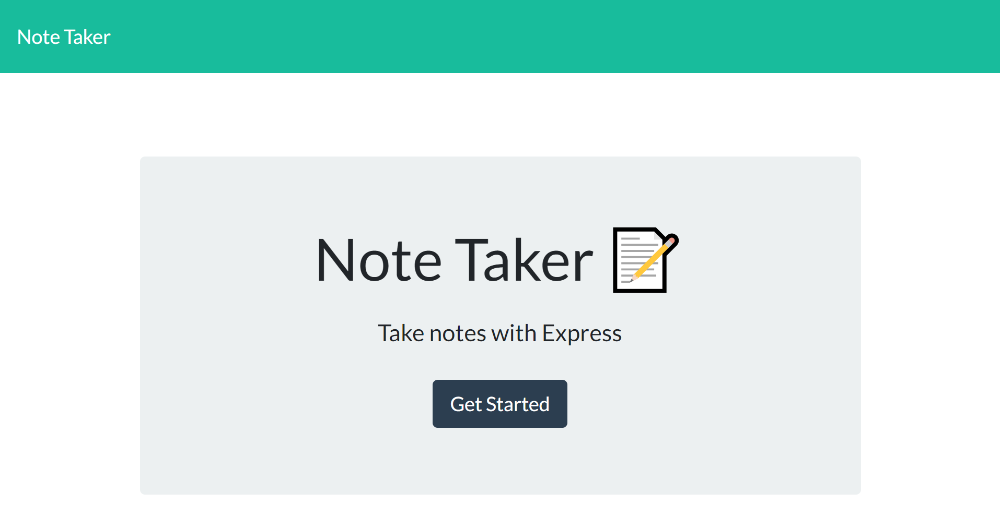
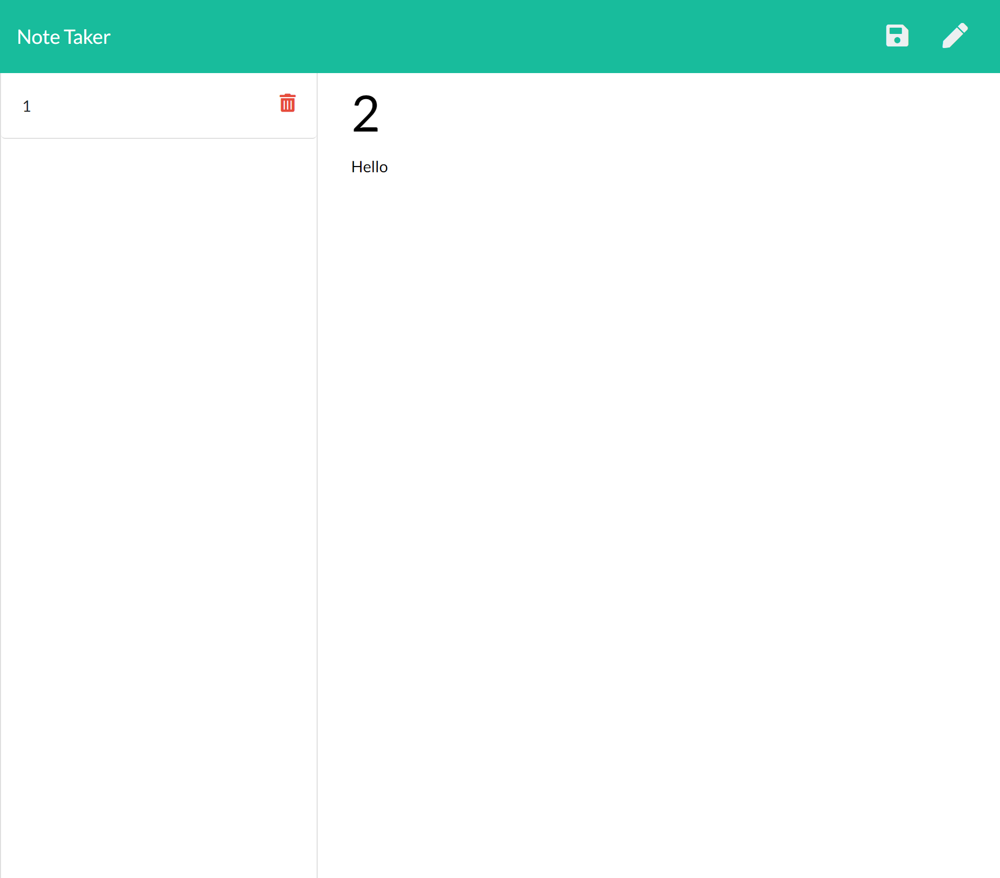

# NoteTaker

# Description
An application that can be used to write, save and delete notes. This application uses express in order to save and retrieve data from a JSON File.

# User Story
AS A user, I want to be able to write and save notes

I WANT to be able to delete notes I've written before

SO THAT I can organize my thoughts and keep track of tasks I need to complete

# Screenshot

# Github Repository 
https://github.com/swoo328/NoteTaker

# Heroku Deployed Application
https://notingtake.herokuapp.com/
